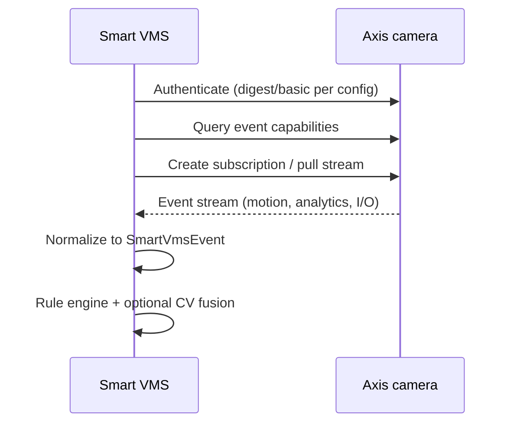

# Axis VAPIX integration

**Status:** Proposed — validate against your camera models and firmware.

## Why VAPIX-first

Axis cameras expose rich **device semantics** beyond RTSP URLs: events, I/O, parameters, users, profiles, and health. Smart VMS treats VAPIX as the **control plane** and RTSP (or other stream URIs) as the **media plane**.

Generic RTSP-only VMS leaves value on the table and complicates per-model behavior.

## VAPIX surfaces (conceptual map)

| Surface | Use in Smart VMS |
|---------|------------------|
| **Parameter API** | Discovery, stream profiles, image settings, time, network |
| **Event API** | Motion, tampering, day/night, digital inputs, analytics events |
| **Video streaming** | RTSP/RTP paths from parameter queries |
| **User management** | Dedicated service account per integration (least privilege) |
| **Firmware / capabilities** | Feature matrix per model |

Exact paths and XML/JSON formats depend on firmware generation; implementation must **probe and cache capabilities**, not hardcode one model.

## Integration principles

1. **Service account** — no shared personal admin; rotate password in vault.
2. **Capability-driven client** — parse what this camera supports before subscribing.
3. **Idempotent event handling** — use stable event keys when available; dedupe window on server.
4. **Respect device limits** — connection counts, subscription counts, stream profiles.
5. **Time sync** — align NTP; reject events with large skew (see event doc).
6. **TLS where supported** — prefer HTTPS to camera; document cert trust for local CAs.

## Event subscription strategy

**Hybrid fusion (proposed):**

- VAPIX motion → pre-filter before GPU inference
- VAPIX analytics events (if available) → map to internal taxonomy
- CV detections → higher confidence for person/vehicle in zone

Dedupe rules in ADR when collision cases are defined.

## Stream selection

| Concern | Approach |
|---------|----------|
| Main vs sub stream | Sub for analytics sampling; main for recording/export |
| Codec | H.264/H.265 per camera support; document transcode policy |
| Auth in URL | Avoid logging query params; use env/vault |

Retrieve stream URIs via parameters rather than hardcoding vendor paths.

## Configuration sync

Parameters to track in registry (non-exhaustive):

- Model, firmware, serial
- Resolution / FPS per profile
- PTZ limits (if applicable)
- Night mode / IR state (for false positive tuning)
- Last successful VAPIX poll timestamp

## Health checks

| Check | Signal |
|-------|--------|
| VAPIX reachable | HTTP 200 on lightweight param |
| Event stream alive | Heartbeat / last event age |
| RTSP alive | Frame read or GOP received |
| Clock | Compare camera time to server |

## Security notes

- Cameras live on trusted LAN segment; isolate IoT VLAN if possible.
- Disable unused VAPIX users and weak auth schemes on camera.
- Never store operator passwords in repo; use `.env` locally (gitignored).

## Testing without hardware

- Recorded VAPIX XML/JSON fixtures per camera model
- Contract tests for parser + normalizer
- Optional Axis virtual devices / second-hand lab camera

## Open items (ADRs)

- Digest vs certificate auth default
- WebSocket vs long-poll for events on your firmware mix
- Whether to deploy ACAP vs external edge only

## References

- Axis VAPIX documentation (on axis.com for your firmware track)
- Internal: [data-model-and-events.md](data-model-and-events.md)
