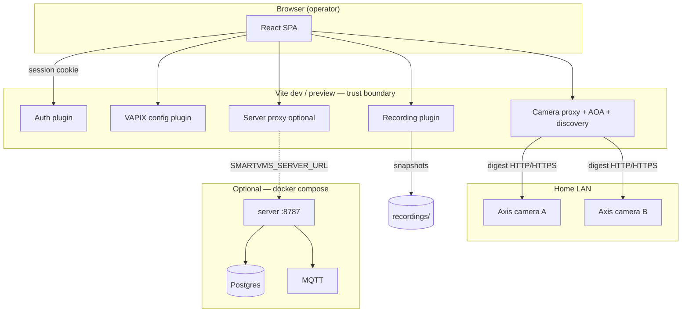

# Architecture overview

**Status:** Decided — Phase 1 UI + recording **shipped**; Phase 3 server **optional dev stack**; edge analytics **Proposed**

See [web-application.md](web-application.md) for the React + Vite app. Quality and security bars: [quality-and-security-bar.md](../engineering/quality-and-security-bar.md).

## Context

- **Cameras:** Axis, controlled via **VAPIX** (HTTP API, event streams, parameters).
- **Deployment:** Home LAN; optional **central server** (Phase 3); optional **edge compute** (Phase 2).
- **Principle:** Cameras produce video; Smart VMS produces **evidence** (clips + structured events).

---

## Phase 1 as-built (shipped today)

The operator UI runs as **React + Vite**. The dev/preview server is a **thin backend** (plugins): auth, VAPIX vault, camera proxy, snapshot recording, optional Phase 3 proxy.



### Shipped vs open

| Shipped (real code path) | Open / Phase 2+ |
|--------------------------|-----------------|
| Session auth, admin/viewer roles | Full H.264 continuous recorder |
| VAPIX proxy (live, snapshot, web UI, device-info, AOA) | Edge CV pipeline (Phase 2) |
| LAN discovery (/24 scan), camera registry | Live VAPIX event subscription → bus |
| Snapshot recording (30 s JPEG), retention API, quota | Object store for event clips |
| Timeline playback from segments API | WebRTC / low-latency live |
| Playwright E2E + Vitest CI | 24h soak sign-off ([soak-test-24h.md](../engineering/soak-test-24h.md)) |
| Phase 3 `server/` + Postgres + MQTT (optional compose) | Phase 3 default in prod deployment |
| UI proxy `/api/vms/*` when server URL set | Semantic search in operator UI |

**Phase 1 exit:** 24h soak — all home cameras record and playback without manual intervention ([roadmap.md](../product/roadmap.md)).

---

## Phase 3 optional stack (dev / integration)

When `SMARTVMS_SERVER_URL` is set and `deploy/docker-compose.yml` runs:

- MQTT ingress with bounded queue ([0002-mqtt-event-bus.md](../decisions/0002-mqtt-event-bus.md))
- Postgres incident store ([0003-postgres-incident-store.md](../decisions/0003-postgres-incident-store.md))
- Webhook on new incident
- Dashboard system health + incident list in UI

Setup: [deploy/README.md](../../deploy/README.md).

---

## Target logical architecture (Phase 2–4)

*Edge ingest, detection, and full server correlation — not complete.*


## Core components (target)

| Component | Responsibility | Today |
|-----------|----------------|-------|
| **Vite plugins** | Auth, VAPIX, proxy, recording | **Shipped** |
| **Ingest adapter** | Stable streams; reconnect | Phase 2 |
| **VAPIX client** | Parameters, events, health | **Partial** (proxy + AOA) |
| **Detection pipeline** | Person/vehicle inference | Phase 2 |
| **Rule engine** | Zones, schedules, debounce | Mock UI |
| **Event publisher** | Normalized bus messages | **Partial** (server MQTT) |
| **Recording service** | Long retention, segments | **Shipped** (JPEG interval) |
| **Incident service** | Alert lifecycle | **Partial** (server store) |
| **Search index** | Metadata queries | **Partial** (keyword API) |
| **Web UI** | Operator workflows | **Shipped** |

## Deployment topology (home v1)

**Collapsed mode (Phase 1 today):** Vite UI + plugins on operator PC; recordings on local disk.

**Optional Phase 3:** `docker compose` for MQTT + Postgres + server on same or second host.

**Split mode (target):** edge near cameras; server on NAS or workstation.

| Mode | Pros | Cons |
|------|------|------|
| Collapsed | Simple ops | CPU contention under load |
| Split | Lower alert latency | Two boxes to patch |

Details: [deployment-home.md](deployment-home.md).

## Communication patterns

| Path | Protocol | Payload | Status |
|------|----------|---------|--------|
| UI → Vite plugins | HTTP + session cookie | `/api/*` | **Shipped** |
| Camera → proxy | Digest HTTP/HTTPS | MJPEG, VAPIX, AOA | **Shipped** |
| UI → server (optional) | HTTP proxy | `/api/vms/*` | **Shipped** |
| Edge → server | MQTT | JSON events + clip refs | **Partial** |
| Camera → ingest | RTSP | Video | Phase 2 |

**ADRs:** [docs/decisions/](../decisions/).

## Failure modes (design for)

| Failure | Expected behavior |
|---------|-------------------|
| Single camera offline | Capture health → degraded/offline; other cameras OK |
| Edge down | Recording continues; alerts pause or VAPIX-only fallback |
| Server down | UI works; incidents empty; recording continues in Vite |
| Disk full | Retention policy; runbook [disk-full.md](../engineering/runbooks/disk-full.md) |
| Clock skew | Reject or quarantine events > N seconds skew |

### Phase 1 operator actions

| Failure | Action |
|---------|--------|
| VAPIX credentials missing | Settings → Cameras (VAPIX) or `.env` |
| Camera unreachable | [camera-offline.md](../engineering/runbooks/camera-offline.md) |
| Dev server stopped | Restart `npm run dev` |

## Security zones

```text
[Internet] — optional — [Tailscale / reverse proxy]
        |
   [Home LAN]
   ├── Cameras (VAPIX/RTSP) — not public
   ├── Operator PC / Vite gateway — session + VAPIX vault
   ├── Edge host (Phase 2)
   └── Server + storage (Phase 3 optional)
```

The **Vite camera proxy** is a trust boundary. See [trust-boundaries.md](trust-boundaries.md) and [security-and-privacy.md](../engineering/security-and-privacy.md).

Cameras should not be reachable from the internet directly.

## Related documents

- [web-application.md](web-application.md) — Phase 1 UI
- [deployment-home.md](deployment-home.md) — home topology by phase
- [trust-boundaries.md](trust-boundaries.md) — security zones
- [edge-vs-server.md](edge-vs-server.md)
- [axis-vapix.md](axis-vapix.md)
- [data-model-and-events.md](data-model-and-events.md)
- [quality-and-security-bar.md](../engineering/quality-and-security-bar.md)
