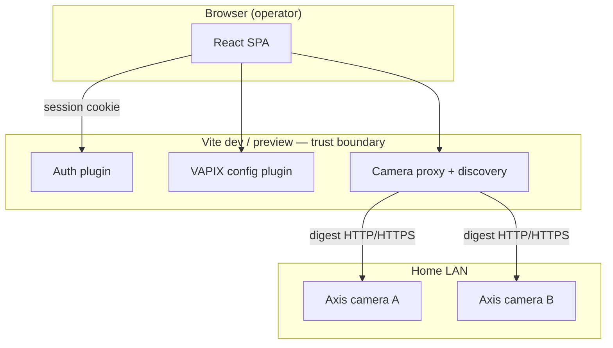

# Architecture overview

**Status:** Decided for Phase 1 UI — target platform architecture below remains **Proposed** until edge/server services land. See [web-application.md](web-application.md) for what is shipped today.

## Context

- **Cameras:** Axis, controlled via **VAPIX** (HTTP API, event streams, parameters).
- **Deployment:** Home LAN; one **central server**; optional **edge compute** (NUC, Jetson, or same host initially).
- **Principle:** Cameras produce video; Smart VMS produces **evidence** (clips + structured events).

## Phase 1 as-built (today)

Phase 1 ships a **React + Vite** operator UI where the dev/preview server acts as a **thin backend** (auth, VAPIX credential vault, camera proxy, LAN discovery). No separate `server/` process, event bus, or recording service yet.



| Shipped (Phase 1) | Not yet built |
|-------------------|---------------|
| Session auth, roles | Recording service |
| VAPIX proxy (live, device-info, web UI) | Event bus / incidents backend |
| LAN discovery (/24 scan) | Edge agent |
| Camera registry (localStorage) | PostgreSQL / object store |

**Phase 1 critical path to exit:** continuous recording + playback soak (24h) — see [roadmap.md](../product/roadmap.md).

## Target logical architecture

*Edge ingest, detection, and server correlation — future phases.*


## Core components (target)

| Component | Responsibility |
|-----------|----------------|
| **Ingest adapter** | Stable streams; handle auth, reconnect, profile selection |
| **VAPIX client** | Parameters, event subscription, health, time sync |
| **Detection pipeline** | Frame sampling, inference, tracking optional |
| **Rule engine** | Zones, schedules, thresholds, debouncing |
| **Ring buffer** | Pre-event video in memory/disk |
| **Event publisher** | Normalized messages to bus; retries, ordering keys |
| **Recording service** | Long retention, segment indexing |
| **Incident service** | Alert lifecycle: open, ack, close, linked clips |
| **Search index** | Metadata queries (class, zone, time, camera) |
| **API gateway** | Auth, REST/WS, rate limits |
| **Web UI** | Operator workflows |

## Deployment topology (home v1)

**Collapsed mode (Phase 1–2):** Vite UI + plugins on operator PC; edge + server may later share one Linux host (Docker Compose).

**Split mode (target):** edge near cameras; server on NAS or workstation.

| Mode | Pros | Cons |
|------|------|------|
| Collapsed | Simple ops | CPU contention under load |
| Split | Lower alert latency | Two boxes to patch |

## Communication patterns

| Path | Protocol | Payload |
|------|----------|---------|
| Camera → ingest | RTSP (TLS if supported) | Video |
| Camera → edge/server | VAPIX HTTP / WS events | Native events |
| Edge → server | MQTT or NATS | JSON events + clip refs |
| UI → server | HTTPS + WSS (prod); HTTP dev | API + live signaling |

**ADR candidates:** message broker, object store, live view stack — see [docs/decisions/](../decisions/).

## Failure modes (design for)

| Failure | Expected behavior |
|---------|-------------------|
| Single camera offline | Alert; other cameras unaffected |
| Edge down | Recording continues on server if centralized; alerts pause or VAPIX-only fallback |
| Server down | Edge buffers events/clips (bounded); drops with metric when full |
| Disk full | Stop new clips; preserve recording policy per config |
| Clock skew | Reject or quarantine events &gt; N seconds skew |

### Phase 1 failures (implemented / operator actions)

| Failure | Expected behavior |
|---------|-------------------|
| VAPIX credentials missing | Proxy returns 503; Settings → Cameras (VAPIX) |
| Camera proxy unreachable | Live view error; check same LAN, camera IP |
| Wrong VAPIX password | Stream test auth_failed; fix Settings or `.env` |
| LAN discovery empty | Set `VITE_CAMERA_SUBNET` or seed `VITE_CAMERA_HOSTS` |
| Dev server stopped | All camera APIs down — restart `npm run dev` |

## Security zones

```text
[Internet] — optional — [Tailscale / reverse proxy]
        |
   [Home LAN]
   ├── Cameras (VAPIX/RTSP) — not public
   ├── Operator PC / Vite gateway — session + VAPIX vault
   ├── Edge host (future)
   └── Server + storage (future)
```

The **Vite camera proxy** is a trust boundary: authenticated operators can reach private camera IPs; SSRF guard limits hosts to RFC1918. See [trust-boundaries.md](trust-boundaries.md) and [security-and-privacy.md](../engineering/security-and-privacy.md).

Cameras should not be reachable from internet directly.

## Related documents

- [web-application.md](web-application.md) — Phase 1 UI (implemented today)
- [deployment-home.md](deployment-home.md) — home topology by phase
- [trust-boundaries.md](trust-boundaries.md) — security zones
- [edge-vs-server.md](edge-vs-server.md)
- [axis-vapix.md](axis-vapix.md)
- [data-model-and-events.md](data-model-and-events.md)
