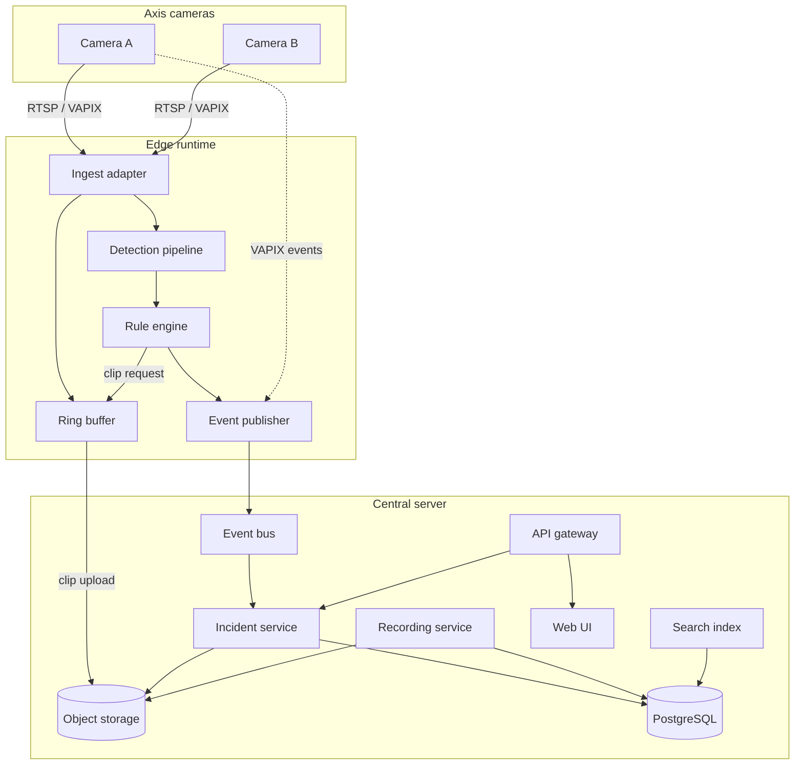

# Architecture overview

**Status:** Proposed (Phase 0) — refine via ADRs as implementation starts.

## Context

- **Cameras:** Axis, controlled via **VAPIX** (HTTP API, event streams, parameters).
- **Deployment:** Home LAN; one **central server**; optional **edge compute** (NUC, Jetson, or same host initially).
- **Principle:** Cameras produce video; Smart VMS produces **evidence** (clips + structured events).

## Logical architecture



## Core components

| Component | Responsibility |
|-----------|----------------|
| **Ingest adapter** | Stable streams; handle auth, reconnect, profile selection |
| **VAPIX client** | Parameters, event subscription, health, time sync |
| **Detection pipeline** | Frame sampling, inference, tracking optional |
| **Rule engine** | Zones, schedules, thresholds, debouncing |
| **Ring buffer** | Pre-event video in memory/disk |
| **Event publisher** | Normalized messages to bus; retries, ordering keys |
| **Recording service** | Long retention, segment indexing |
| **Incident service** | Alert lifecycle: open, ack, close, linked clips |
| **Search index** | Metadata queries (class, zone, time, camera) |
| **API gateway** | Auth, REST/WS, rate limits |
| **Web UI** | Operator workflows |

## Deployment topology (home v1)

**Collapsed mode (acceptable for Phase 1–2):** edge + server on one Linux host (Docker Compose).

**Split mode (target):** edge near cameras (garage/utility closet switch); server on NAS or workstation.

| Mode | Pros | Cons |
|------|------|------|
| Collapsed | Simple ops | CPU contention under load |
| Split | Lower alert latency | Two boxes to patch |

## Communication patterns

| Path | Protocol | Payload |
|------|----------|---------|
| Camera → ingest | RTSP (TLS if supported) | Video |
| Camera → edge/server | VAPIX HTTP / WS events | Native events |
| Edge → server | MQTT or NATS | JSON events + clip refs |
| UI → server | HTTPS + WSS | API + live signaling |

**ADR candidates:** message broker, object store, live view stack.

## Failure modes (design for)

| Failure | Expected behavior |
|---------|-------------------|
| Single camera offline | Alert; other cameras unaffected |
| Edge down | Recording continues on server if centralized; alerts pause or VAPIX-only fallback |
| Server down | Edge buffers events/clips (bounded); drops with metric when full |
| Disk full | Stop new clips; preserve recording policy per config |
| Clock skew | Reject or quarantine events &gt; N seconds skew |

## Security zones

```text
[Internet] — optional — [Tailscale / reverse proxy]
        |
   [Home LAN]
   ├── Cameras (VAPIX/RTSP)
   ├── Edge host
   └── Server + storage
```

Cameras should not be reachable from internet directly. See [security-and-privacy.md](../engineering/security-and-privacy.md).

## Related documents

- [edge-vs-server.md](edge-vs-server.md)
- [axis-vapix.md](axis-vapix.md)
- [data-model-and-events.md](data-model-and-events.md)
