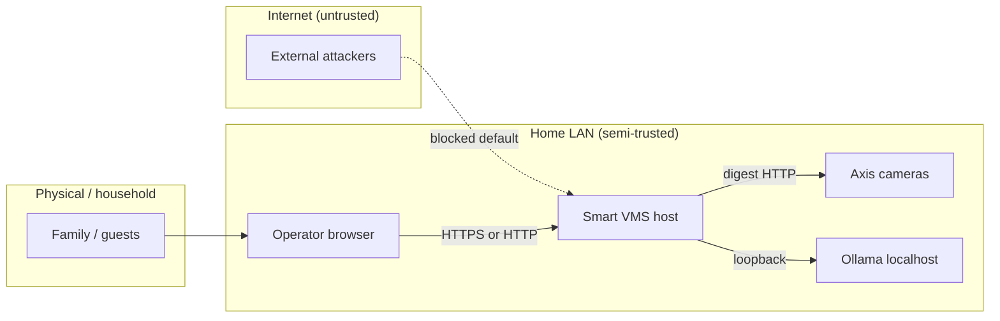

# Trust boundaries

**Status:** Decided — home deployment threat model

## Zones

| Zone | Trust level | Assets |
|------|-------------|--------|
| **Operator browser** | Trusted after login | Session cookie, UI state |
| **Smart VMS host** | Trusted compute | VAPIX secrets, audit log, future recordings |
| **Home LAN** | Semi-trusted | Camera streams, device admin UIs |
| **Internet** | Untrusted | No inbound by default |
| **Cameras** | Device trust | Video, VAPIX account |

## Controls by boundary

### Browser ↔ Smart VMS

| Control | Implementation |
|---------|----------------|
| Authentication | HttpOnly session cookie, HMAC-signed |
| Authorization | Admin vs viewer on API + UI |
| CSRF | SameSite=Strict cookie |
| XSS | CSP on auth responses; React default escaping |
| Frame embedding | X-Frame-Options DENY on Smart VMS (not on camera proxy responses) |

### Smart VMS ↔ Cameras

| Control | Implementation |
|---------|----------------|
| SSRF prevention | Allowlist private IPv4 only |
| Credential isolation | Server-side digest; never expose password to browser |
| Least privilege | Dedicated VAPIX user per [axis-vapix.md](axis-vapix.md) |
| Transport | HTTP on LAN today; HTTPS when camera supports |

### Smart VMS ↔ Ollama

| Control | Implementation |
|---------|----------------|
| Network | Localhost only via Vite proxy |
| Auth | Requires Smart VMS session |
| Data sent | Chat text only — no raw video to LLM by default |

### Stored secrets

| Secret | Location | Never in |
|--------|----------|----------|
| Admin password | `.env` | git, client |
| Session secret | `.env` | git |
| VAPIX password | Encrypted file or `.env` | localStorage, git |
| Camera RTSP URLs | — | logs with credentials |

## Privacy boundaries (home)

| Data | Default | Notes |
|------|---------|-------|
| Indoor face bbox | Off | Face rec opt-in |
| Face identification | Household registry only | No neighbor ID |
| Recording retention | Configurable quota | [../product/storage-quota.md](../product/storage-quota.md) |
| Audit log | Credential changes | [../engineering/cyber-resilience-act.md](../engineering/cyber-resilience-act.md) |
| Clip export | Operator-initiated | No auto cloud upload |

## Threat scenarios

| Threat | Mitigation | Residual risk |
|--------|------------|---------------|
| LAN attacker hits camera proxy | SSRF allowlist + session required | Compromised logged-in session |
| Stolen laptop with session | Session TTL; re-auth for admin | Physical access |
| Credential file theft | AES-256-GCM + file permissions | Host compromise |
| Malicious iframe in camera UI | Sandbox attrs; proxy strips some headers | Axis UI JS trust |
| Supply chain | Lockfiles, CI, CRA SBOM (future) | Dependency vulnerabilities |

## Future boundaries (Phase 3+)

- **Edge agent ↔ server:** mTLS or pre-shared key on LAN
- **Remote access:** Tailscale or reverse proxy ADR — no port-forward by default
- **Notifications:** Webhook signing, no PII in push title

Decisions recorded in `docs/decisions/` when implemented.

## Related

- [../engineering/security-and-privacy.md](../engineering/security-and-privacy.md)
- [../engineering/authentication.md](../engineering/authentication.md)
- [web-application.md](web-application.md)
