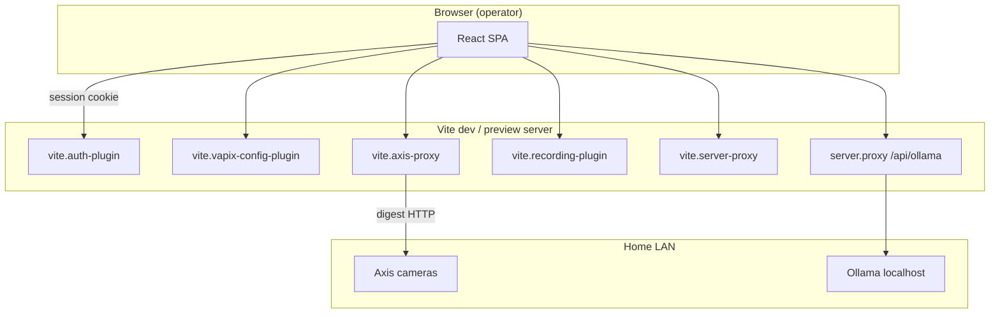

# Web application architecture

**Status:** Decided — Phase 1 implementation in `web/`

## Overview

The Phase 1 operator UI is a **React + Vite** single-page application. The dev server doubles as a **thin backend** via Vite plugins that implement auth, VAPIX config, and Axis camera proxying.



## Frontend structure

```text
web/src/
├── components/     UI by domain (camera, alarm, face, map, workspace, …)
├── context/        AppConfig, Auth, Workspace state
├── hooks/          Device info, stream test, tier-2
├── lib/            API clients, mock data, intents, storage
├── pages/          Route shells
└── types/          Domain TypeScript types
```

### Key contexts

| Context | Responsibility |
|---------|----------------|
| `AuthContext` | Session user, login/logout, permissions |
| `AppConfigContext` | Cameras, alarms, face settings, map, storage |
| `WorkspaceContext` | Active workspace + URL params |

### Routing

- `/` — Chat home (Copilot + optional workspace panel)
- `/login` — Authentication
- `/settings` — Admin/viewer settings
- Workspace opened via chat intent or sidebar; params in query string

## Vite plugins (server-side)

| Plugin | File | Responsibility |
|--------|------|----------------|
| Auth | `vite.auth-plugin.ts` | Login, session HMAC, rate limit, security headers |
| VAPIX config | `vite.vapix-config-plugin.ts` | CRUD encrypted camera credentials |
| Camera proxy | `vite.axis-proxy.ts` | MJPEG, snapshot, stream-test, web UI, device-info, AOA, recorded events |
| Recording | `vite.recording-plugin.ts` | Snapshot interval capture, segments, quota, capture health |
| Server proxy | `vite.server-proxy.ts` | Optional `/api/vms/*` → Phase 3 central server |

Shared logic in `web/server/`:

- `auth.ts` — session tokens, roles
- `vapix-config.ts` — credential resolution (file → env)
- `credential-store.ts` — AES-256-GCM encryption
- `camera-proxy-shared.ts` — SSRF guard, HTML rewrite, VAPIX param parse
- `audit-log.ts` — credential change audit trail

## Data layer (Phase 1–3)

| Data | Storage | Notes |
|------|---------|--------|
| Session | HttpOnly cookie | — |
| VAPIX creds | Encrypted file | Vault / DB later |
| Cameras, map, faces | localStorage | Registry + placements |
| Recording quota | `recordings/storage-settings.json` + browser mirror | Enforced on capture |
| Recordings | `recordings/` manifest + JPEG frames | 30 s interval |
| Alarms | In-memory (session) | Persistence planned |
| Incidents | Phase 3 server (Postgres) when `SMARTVMS_SERVER_URL` set | Else empty in UI |

Types align with [data-model-and-events.md](data-model-and-events.md) for forward compatibility.

## Live video path

```text

  → axis-proxy middleware
  → resolveCameraProxyAuth (session + VAPIX creds)
  → DigestClient → camera /axis-cgi/mjpg/video.cgi
  → stream to browser
```

Fallback: snapshot polling if MJPEG fails.

## Camera web UI path

```text
<iframe src="/api/camera/192.168.x.x/web/">
  → digest fetch HTML
  → rewrite URLs + inject fetch shim
  → operator sees authenticated Axis UI
```

See [../product/camera-web-ui.md](../product/camera-web-ui.md).

## Copilot path

```text
User message
  → resolveChatIntent (keyword) OR Ollama chat API
  → WorkspaceContext opens panel
  → LLM system prompt lists tools/workspaces (copilot-prompt.ts)
```

## Build and test

- **Build:** `tsc -b` + Vite bundle → `dist/`
- **Tests:** Vitest on `server/` and `src/lib/` pure logic
- **CI:** `.github/workflows/ci.yml`

## Failure modes

| Failure | Behavior |
|---------|----------|
| No VAPIX creds | Stream test `missing_credentials`; settings prompt |
| Camera offline | Stream test `unreachable`; error in LiveStream |
| Ollama down | Copilot shows offline; keyword intents still work |
| No session secret | Random key per boot — sessions lost on restart |

## Related

- [trust-boundaries.md](trust-boundaries.md)
- [../engineering/api-conventions.md](../engineering/api-conventions.md)
- [overview.md](overview.md) — full system (future edge + server)
