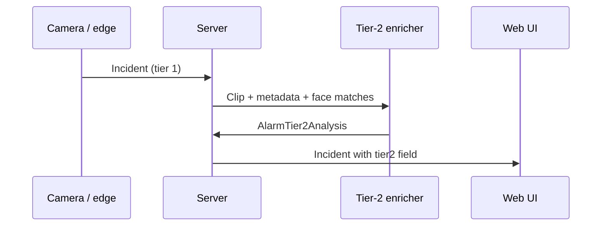

# Tier-2 analytics on alarm

**Status:** Proposed — rule-based mock in `web/`; real pipeline in Phase 2–3

## Purpose

When a camera triggers an alarm, a **second analysis tier** runs that explains:

- **What happened** — rule, confidence, camera, context
- **People** — known/unknown via face registry, roles, camera memory
- **Priority** — routine, review, or urgent

Tier 1 is raw detection (rule + best picture). Tier 2 is the human-readable narrative for the operator.

## Data model

`AlarmTier2Analysis` (`web/src/types/alarm-analytics.ts`):

| Field | Description |
|-------|-------------|
| `headline` | Short title |
| `summary` | Narrative summary |
| `triggerExplanation` | Why the rule fired |
| `persons[]` | Known, unknown, or inferred persons |
| `insights[]` | Bullet points for operator |
| `assessedPriority` | `routine` / `review` / `urgent` |
| `sources` | `rule`, `object_detection`, `face_recognition`, `vapix` |

Optional cache on `Incident.tier2` when backend/edge has generated analysis.

## UI

| Location | Display |
|----------|---------|
| Forensic | Full `AlarmTier2Panel` on selected alarm |
| Dashboard | Compact analysis under recent alarms |
| Alarm list | Tier-2 headline under alarm title |

## Pipeline (target)

Phase 1: generated client-side from mock rules in `web/src/lib/alarm-tier2-analytics.ts`.

Future: Ollama or server model on clip metadata only (no full video upload by default).

## Privacy

- Tier 2 must not **identify** non-household persons by name
- Face sources only when [face-recognition.md](face-recognition.md) opt-in is active
- Log model/version in `sources` for explainability

## Acceptance (Phase 3)

- [ ] Tier 2 generated within 5s of incident on LAN
- [ ] Operator can trace each insight to a source type
- [ ] False narrative rate acceptable on 7-day home trial

## Related

- [face-recognition.md](face-recognition.md)
- [forensic.md](forensic.md)
- [../architecture/edge-vs-server.md](../architecture/edge-vs-server.md)
